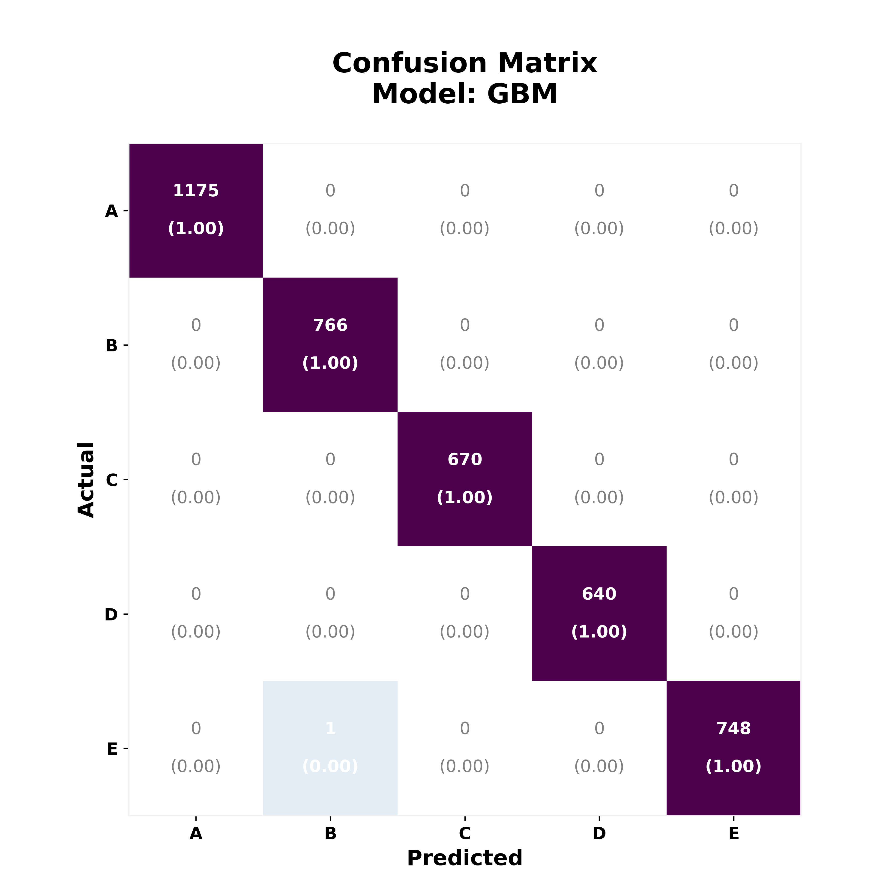

 
<a href="http://nbviewer.jupyter.org/github/reyvaz/Human-Activity-Recognition/blob/master/qualifying_workouts.ipynb" target="_blank">Click Here</a>
to see the Notebook online in Jupyter nbviewer.

# Qualifying Human Activity

#### Notebook testing various classification algorithms on accelerometer data to qualify how individuals perform weight-lifting exercises

The best performing algorithms are a K-Nearest and a GBM Classifier with over **99.9% accuracy, precision, recall, and F1** on 5 classes.

The data comes from Veloso et al., (2013). The original dataset and more information can be found [here](http://groupware.les.inf.puc-rio.br/har). The direct link to download the data is found [here](http://groupware.les.inf.puc-rio.br/static/WLE/WearableComputing_weight_lifting_exercises_biceps_curl_variations.csv). 

#### Contents:

- [qualifying_workouts.ipynb](qualifying_workouts.ipynb): Jupyter notebook with the Python code to process the data, the algorithms, and report.
- [cm_heat_plots.py](cm_heat_plots.py): A Python script with functions to plot the confusion matrices
- [confusion_matrixGBM.png](confusion_matrixGBM.png): An output image.
- [README.md](README.md): This File  

 

 

 
